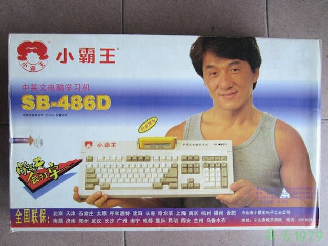

+++
title = "Welcome to Whallipop's Coding World"
date = 2023-12-15T13:25:02+08:00
draft = false
+++


 A journey of a thousand miles begins with a single step. 


# Cold Day

It was such a cold day, and I was sitting at the backseat of my car, typing these words, and decided to start my tech blog to share my coding life.

I am glad to see you come to here. My main topic will always be **Game** and **Game Development**, but this site will also include topics about **Making Vlog from Code**, **AI Models Application**, **Theorecical Visualization** and **Music Composition**.

<!-- Some posts you might be interested in: -->

The following content of this article is about my experience, motivation and psychological activites for starting this blog site. If you're not interested in them, feel free to browse the other posts. I want to create content that everyone can enjoy and discuss. I am not an extremely high level programmer. Let's get into it and make progress together!

# My Start Point of Game Development

When I was a little child, my mom bought me a fake NES, which was looked like a "keyboard" and can be played with faked NES game card. 

At that time, most of the children played lots of games through this device, and so did I. But I also finished the task of practice typing from mom. With the stiff feel of this rough keyboard, I recklessly knocked out the door of the Internet World.

But In fact, I didn't start programming until I was in college and I didn't have any prior knowledge that would help me code better. I studied the basics of computer systems, programming language syntax and so on. During my graduate and undergraduate education, I finally found my interest in game development and computer graphics.

Recalling that in high school, I made a small game using RPG Maker in my spare time. This experience left a deep impression on me. I was obssessed with developing day and night, until one day my system was crashed and I lost all my game data. After a long time in college and working in a company, I realized that the dream of making my own game was still my goal in the future.

# Other Topics...

I quite enjoy programming, although I am not crazy about it. After I decided to do something for recording my future coding life, I learned a lot about **front-end** as the cool effects it cound make were really impressive and attracted me to master it. And since I enjoy **visualization of knowledge** in simple ways, using front-end tools to present knowledge with image or animations is a very interesting challenge for me.

What's more, the **LLM (Large Laguage Model)** and **Image Generation** using deep learning have become very popular in recent time. Although I have done some research on applying deep learning to computer graphics, I will not focus on the theory and implementation of specific network at this time (maybe I will, who knows). Instead, I am going to put together AI networks to see how efficient it can be if I use it in my coding life.

Besides I love composing music. This site will record some knowledge and experience about **music creation**.

That's a lot. I am always a greedy person since I was a child. Good luck to myself.
